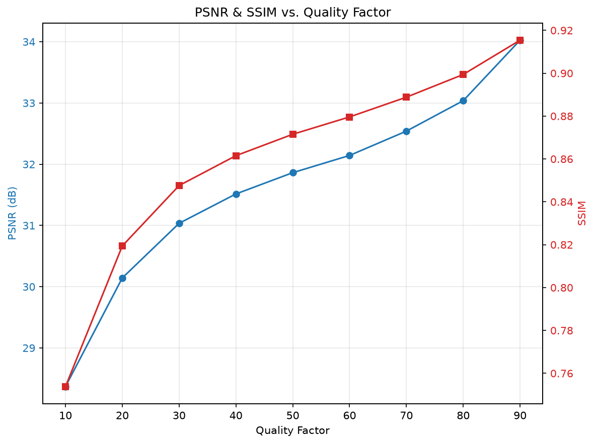

# JPEG Compression Engine (From Scratch)

A from-scratch implementation of the core JPEG compression pipeline in Python: color transform, chroma subsampling, block-based DCT + quantization, zigzag scanning, and DC/AC symbol encoding.

**Not a full JPEG codec** — Huffman entropy coding isn't implemented, so this doesn't produce a real `.jpg` bitstream. See [Limitations](#limitations).

## Pipeline

```
RAW → RGB → YCbCr → chroma subsample → 8x8 DCT + quantize → zigzag → DC diff / AC RLE
```

| File | Responsibility |
|---|---|
| `config.py` | Quantization tables, chroma subsampling constant |
| `color.py` | RGB ↔ YCbCr, chroma downsample/upsample |
| `block_codec.py` | 8x8 block DCT + quantization |
| `scan.py` | Zigzag scan / inverse |
| `entropy_lite.py` | DC differential + AC run-length coding |
| `raw_io.py` | RAW file loading |
| `metrics.py` | PSNR / SSIM |
| `output_io.py` | Save reconstructed images |
| `rd_curve.py` | Quality-vs-metric curve plotting |
| `pipeline.py` | `JpegPipeline` — ties all stages together |
| `main.py` | CLI entry point |

## Install

```bash
conda create -n jpeg_env python=3.11
conda activate jpeg_env
pip install -r requirements.txt
```

## Usage

```bash
python src/main.py --input data/test_image_01.ARW --quality 50
```

| Argument | Default | Description |
|---|---|---|
| `--input`, `-i` | required | Path to RAW image |
| `--quality`, `-q` | `50` | One or more quality factors (0–100) |
| `--subsampling` | `4:2:0` | `4:2:0` / `4:2:2` / `4:4:4` |
| `--save` | off | Save reconstructed image(s) + curve plot to `--output-dir` |
| `--show` | off | Display reconstructed image(s) + curve plot |
| `--output-dir` | `outputs` | Save location |
| `--plot-curve` | off | `psnr` / `ssim` / `both` (bare flag = `psnr`) |

Example — sweep qualities and plot both metrics:
```bash
python src/main.py --input data/test_image_01.ARW --quality 10 20 30 40 50 60 70 80 90 --plot-curve both --save
```

## Benchmark

`data/test_image_01.ARW` (Sony A7 III RAW, 4024x6024), 4:2:0 subsampling:

| Quality | Sparsity (%) | PSNR (dB) | SSIM |
|---:|---:|---:|---:|
| 10 | 97.58 | 28.37 | 0.7538 |
| 20 | 95.93 | 30.14 | 0.8194 |
| 30 | 94.53 | 31.04 | 0.8476 |
| 40 | 93.39 | 31.51 | 0.8615 |
| 50 | 92.31 | 31.86 | 0.8715 |
| 60 | 91.16 | 32.14 | 0.8796 |
| 70 | 89.46 | 32.54 | 0.8888 |
| 80 | 86.82 | 33.04 | 0.8994 |
| 90 | 80.89 | 34.03 | 0.9154 |



| Quality 10 | Quality 90 |
|---|---|
|  |  |

## Sample Data

`data/test_image_01.ARW` (Sony A7 III RAW) is from [Signature Edits](https://www.signatureedits.com/free-raw-photos/), credit Ryan Breitkreutz ([license](https://www.signatureedits.com/free-raw-license-terms/): free for commercial/non-commercial use, no attribution required). Not committed to this repo (47MB RAW file, unsuited to Git regardless of license) — download your own from the link above and place it under `data/`.

## Limitations

- No Huffman coding — no real compressed bitstream or valid `.jpg` output
- `--save` writes reconstructed pixels (e.g. PNG); file size ≠ true JPEG size
- RD curve x-axis is quality factor, not measured bpp (no entropy stage to measure)
